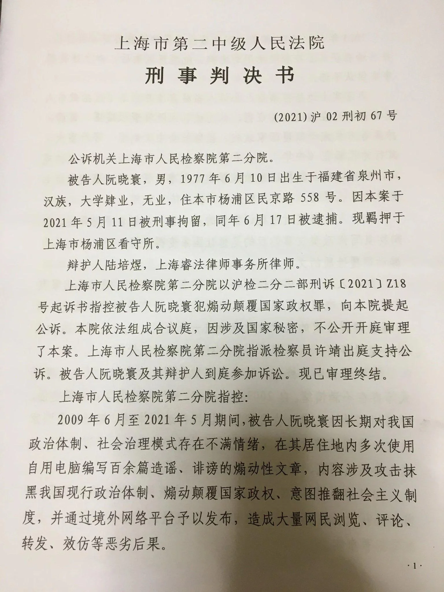
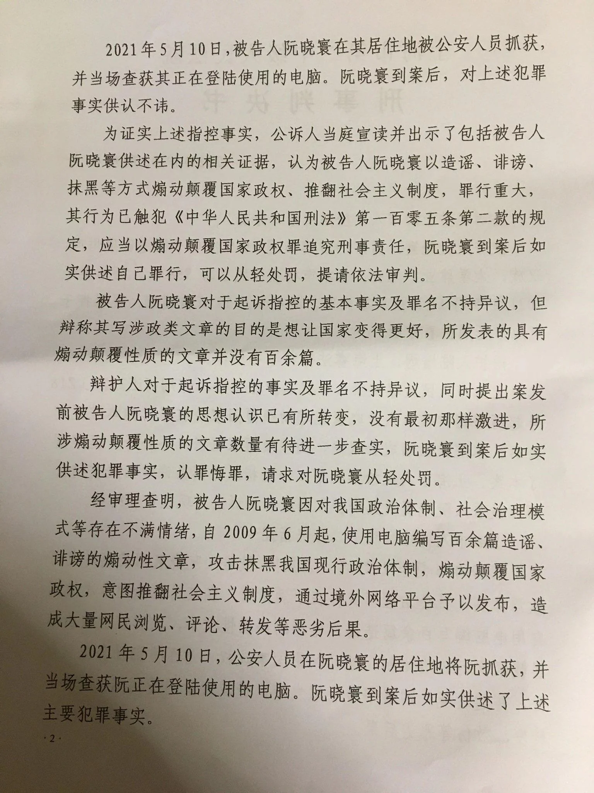
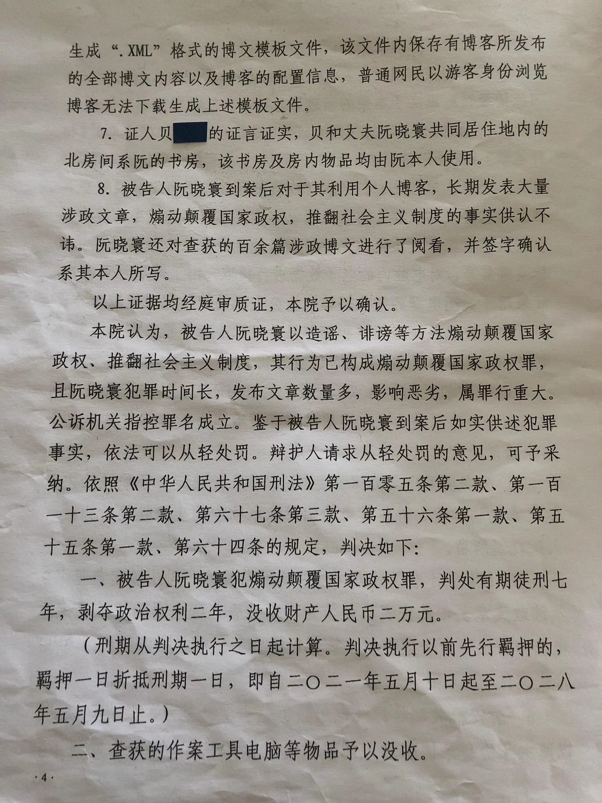
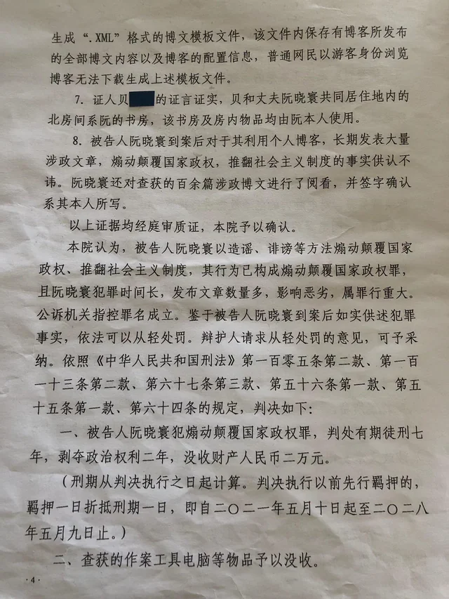
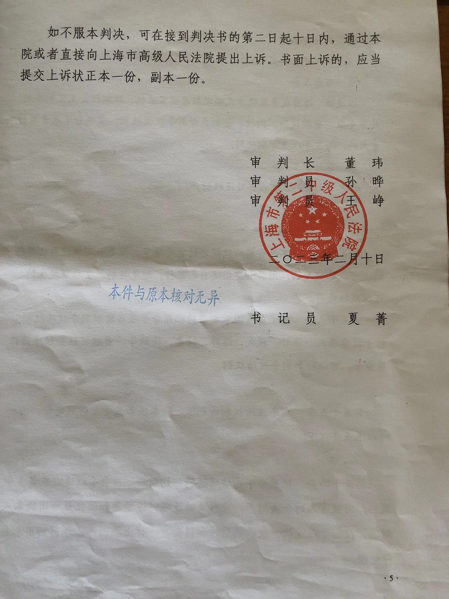
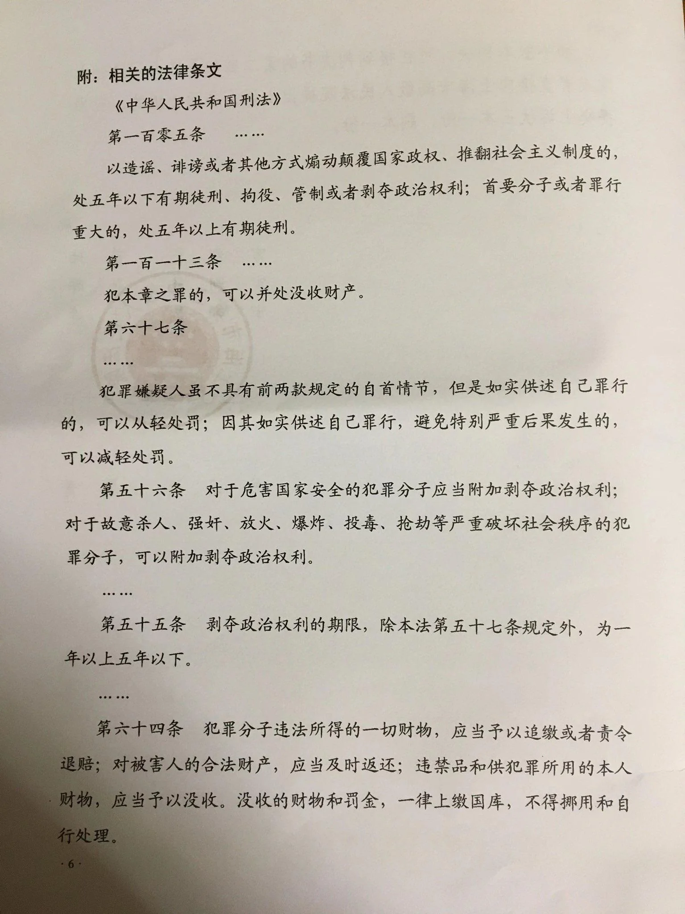

# 编程随想（阮晓寰）的判决书全文
 
 
 
 
 
 

## 经OCR后的文字版
（如有错误欢迎纠正，谢谢）

## 上海市第二中级人民法院

刑事判决书

（2021）沪02刑初67号

公诉机关上海市人民检察院第二分院。

被告人阮晓寰，男，1977年6月10日出生于福建省泉州市，汉族，大学肄业，无业，住本市杨浦区民京路558号。因本案于2021年5月11日被刑事拘留，同年6月17日被逮捕。现羁押于上海市杨浦区看守所。

辩护人陆培煜，上海睿法律师事务所律师。

上海市人民检察院第二分院以沪检二分二部刑诉〔2021〕Z18号起诉书指控被告人阮晓寰犯煽动颠覆国家政权罪，向本院提起公诉。本院依法组成合议庭，因涉及国家秘密，不公开开庭审理了本案。上海市人民检察院第二分院指派检察员许靖出庭支持公诉。被告人阮晓寰及其辩护人到庭参加诉讼。现已审理终结。

上海市人民检察院第二分院指控：

2009年6月至2021年5月期间，被告人阮晓寰因长期对我国政治体制、社会治理模式存在不满情绪，在其居住地内多次使用自用电脑编写百余篇造谣、诽谤的煽动性文章，内容涉及攻击抹黑我国现行政治体制、煽动颠覆国家政权、意图推翻社会主义制度，并通过境外网络平台予以发布，造成大量网民浏览、评论、转发、效仿等恶劣后果。

2021年5月10日，被告人阮晓寰在其居住地被公安人员抓获，并当场查获其正在登陆使用的电脑。阮晓寰到案后，对上述犯罪事实供认不讳。

为证实上述指控事实，公诉人当庭宣读并出示了包括被告人阮晓寰供述在内的相关证据，认为被告人阮晓寰以造谣、诽谤、抹黑等方式煽动颠覆国家政权、推翻社会主义制度，罪行重大，其行为已触犯《中华人民共和国刑法》第一百零五条第二款的规定，应当以煽动颠覆国家政权罪追究刑事责任，阮晓寰到案后如实供述自己罪行，可以从轻处罚，提请依法审判。

被告人阮晓寰对于起诉指控的基本事实及罪名不持异议，但辩称其写涉政类文章的目的是想让国家变得更好，所发表的具有煽动颠覆性质的文章并没有百余篇。

辩护人对于起诉指控的事实及罪名不持异议，同时提出案发前被告人阮晓寰的思想认识已有所转变，没有最初那样激进，所涉煽动颠覆性质的文章数量有待进一步查实，阮晓寰到案后如实供述犯罪事实，认罪悔罪，请求对阮晓寰从轻处罚。

经审理查明，被告人阮晓寰因对我国政治体制、社会治理模式等存在不满情绪，自2009年6月起，使用电脑编写百余篇造谣、诽谤的煽动性文章，攻击抹黑我国现行政治体制，煽动颠覆国家政权，意图推翻社会主义制度，通过境外网络平台予以发布，造成大量网民浏览、评论、转发等恶劣后果。

2021年5月10日，公安人员在阮晓寰的居住地将阮抓获，并当场查获阮正在登陆使用的电脑。阮晓寰到案后如实供述了上述主要犯罪事实。

证明上述事实的证据有：

1.公安机关出具的《立案决定书》《受案登记表》《抓获经过》《抓捕经过》证实了本案的侦破以及被告人阮晓寰的到案经过。

2.公安机关制作的《搜查证》《搜查笔录》《扣押清单》《扣押笔录》《现场勘验笔录》及相关照片、《电子数据现场提取笔录》证实，公安人员依法对被告人阮晓寰的居住地进行勘验及搜查，在现场次卧室的书桌上有一台宏基牌笔记本电脑，该电脑连有显示器及键盘，通过该电脑电源灯判断处于开启状态，通过摇动鼠标唤醒屏幕，对电脑内的电子数据进行提取，由于提取时间较长，故采用不关闭电源的方式，移机至公安机关继续完成提取工作。同时，公安机关还查获并扣押苹果手机、小米手机、华为笔记本电脑、东芝移动硬盘、U盘、键盘等物品。

3.公安机关制作的《远程勘验笔录》证实，公安人员通过网络远程勘验，从被告人阮晓寰的博客提取博文数百篇，其中包含百余篇涉政文章。

4.公安机关出具的《鉴定书》证实，经鉴定，不能排除宏基笔记本电脑键盘、外接键盘的棉签涂取物中的生物性物质为被告人阮晓寰所留。

5.上海弘连电子数据司法鉴定所出具的《司法鉴定意见书》及涉政文章复印件证实，经鉴定，从被告人阮晓寰的宏基笔记本电脑中检出十余个虚拟机、数百篇博文等；在电脑内发现“.XML”格式文件。

6.公安机关制作的《电子数据侦查实验笔录》及光盘证实，以博主身份登录博客后，能够通过博客自带的“备份”功能下载生成“.XML”格式的博文模板文件，该文件内保存有博客所发布的全部博文内容以及博客的配置信息，普通网民以游客身份浏览博客无法下载生成上述模板文件。

7.证人贝**的证言证实，贝和丈夫阮晓寰共同居住地内的北房间系阮的书房，该书房及房内物品均由阮本人使用。

8.被告人阮晓寰到案后对于其利用个人博客，长期发表大量涉政文章，煽动颠覆国家政权，推翻社会主义制度的事实供认不讳。阮晓寰还对查获的百余篇涉政博文进行了阅看，并签字确认系其本人所写。

以上证据均经庭审质证，本院予以确认。

本院认为，被告人阮晓寰以造谣、诽谤等方法煽动颠覆国家政权、推翻社会主义制度，其行为已构成煽动颠覆国家政权罪，且阮晓寰犯罪时间长，发布文章数量多，影响恶劣，属罪行重大。公诉机关指控罪名成立。鉴于被告人阮晓寰到案后如实供述犯罪事实，依法可以从轻处罚。辩护人请求从轻处罚的意见，可予采纳。依照《中华人民共和国刑法》第一百零五条第二款、第一百一十三条第二款、第六十七条第三款、第五十六条第一款、第五十五条第一款、第六十四条的规定，判决如下：

一、被告人阮晓寰犯煽动颠覆国家政权罪，判处有期徒刑七年，剥夺政治权利二年，没收财产人民币二万元。

（刑期从判决执行之日起计算。判决执行以前先行羁押的，羁押一日折抵刑期一日，即自二O二一年五月十日起至二O二八年五月九日止。）

二、查获的作案工具电脑等物品予以没收。

如不服本判决，可在接到判决书的第二日起十日内，通过本院或者直接向上海市高级人民法院提出上诉。书面上诉的，应当提交上诉状正本一份，副本一份。